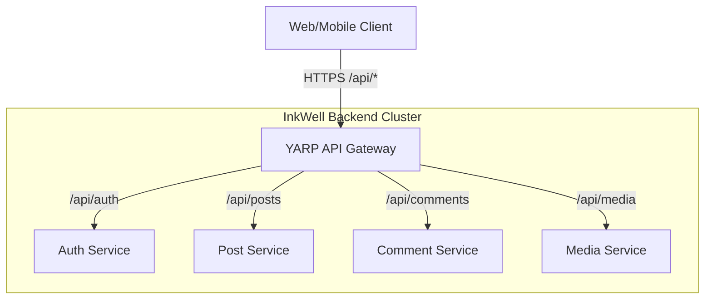

# 🚀 InkWell API Gateway & Core Infrastructure (UC-1)


This module forms the backbone of the InkWell Microservices Platform. It consists of the **YARP-based API Gateway** and the **InkWell.Shared** class library which enforces consistency across all downstream services.

## 🏗️ Architecture Design

The API Gateway is the singular entry point for all client requests, abstracting the internal microservice topology. 



## 📦 Components

### 1. `InkWell.API.Gateway`
Built on Microsoft's **YARP (Yet Another Reverse Proxy)**, it provides:
- **Centralized Routing**: Maps external `/api/{service}` requests to internal service ports (e.g., `7001-7007`).
- **CORS Management**: Global Cross-Origin Resource Sharing policies for the Angular frontend.
- **SSL Termination & Load Balancing**: (Configurable for production environments).

### 2. `InkWell.Shared`
A deeply integrated NuGet/Class library referenced by all microservices to maintain DRY principles:
- **Generic Wrappers**: `BaseResponse<T>` and `PagedResponse<T>` for consistent API contracts.
- **Event Contracts**: Strongly-typed C# records/classes for RabbitMQ events (`PostCreatedEvent`, `UserRegisteredEvent`, etc.) used by MassTransit.
- **Exceptions & Middleware**: Global exception handling structures.

## ⚙️ Configuration Setup

### Gateway `appsettings.json` Routing Example:
```json
"ReverseProxy": {
  "Routes": {
    "auth-route": {
      "ClusterId": "auth-cluster",
      "Match": { "Path": "/api/auth/{**catch-all}" }
    }
  },
  "Clusters": {
    "auth-cluster": {
      "Destinations": {
        "auth-destination": { "Address": "http://localhost:7001" }
      }
    }
  }
}
```

## 🚀 How to Run Locally

```powershell
cd gateway/InkWell.API.Gateway
dotnet run
```
**Access Endpoint:** `http://localhost:7000/api/{service}`
